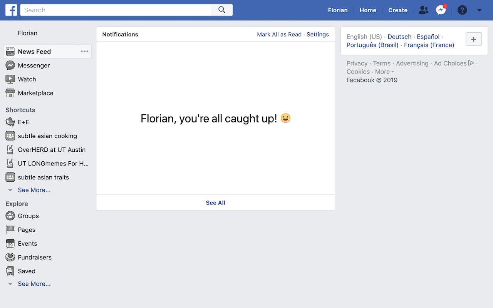

# Defang for Facebook

Browser extension to make Facebook less addictive. Available for [Chrome](https://chrome.google.com/webstore/detail/defang-for-facebook/lmnbinmplnbhnefoknofadelajkjeehl) and [Firefox](https://addons.mozilla.org/firefox/addon/defang-for-facebook/).

## Features

-   replaces the homefeed with the notification view (can be bypassed after viewing notifications)
-   hides notifications if nothing unread (shows "You're all caught up" instead)
-   limits and scrolls down infinite scroll
-   hides number of reactions, comments, shares
-   stops reload when clicking the top left Facebook icon
-   disables chat in Facebook, use Messenger.com instead
-   hides chat count in top right icon
-   hides "someone is typing" message
-   disables group highlights and comments on followed posts
-   hides group notification count in left sidebar
-   grayscale icons in left sidebar
